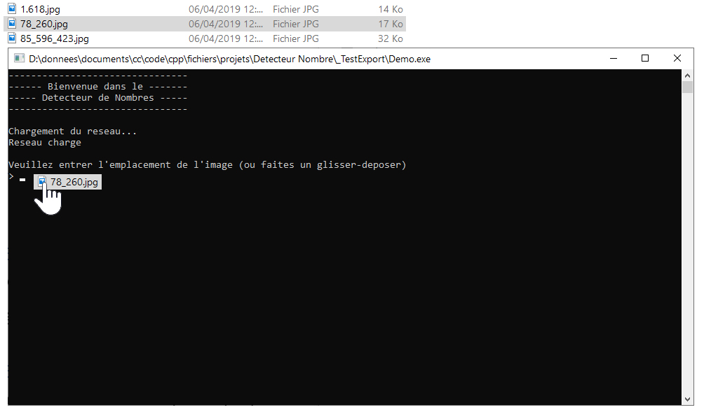
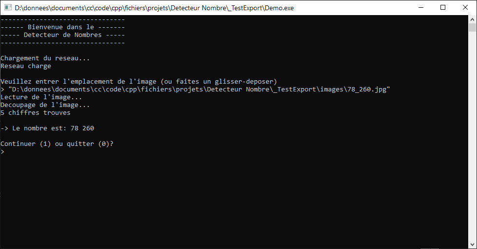
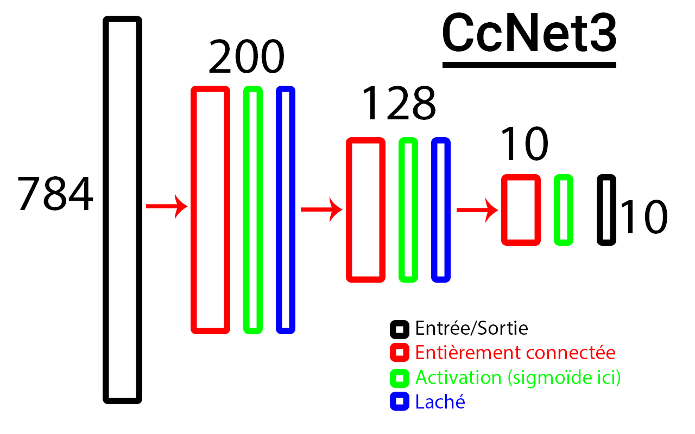
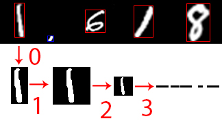

# Number-Detector
A C++ program which reads a number within an image.
This project is a small student project, the goal was to
demonstrate how a neural network can learn with differentiation
and matrix calculus.

## Some screenshots
Here is a simple example

Model's architecture (Cc Net 3)

Processing

